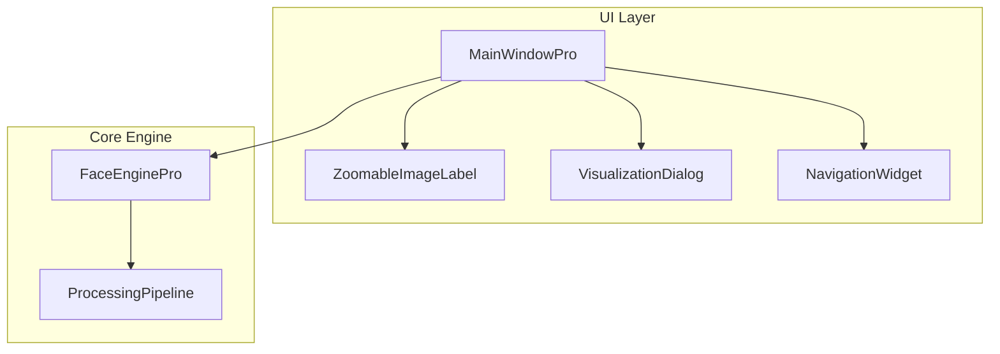

# DeepFocus Pro v2.0 全面升级计划

## 架构概览




## 文件改动清单

| 文件 | 操作 | 说明 ||------|------|------|| [`gui/zoomable_label.py`](gui/zoomable_label.py) | 新建 | 可缩放图像组件 || [`gui/visualization_dialog.py`](gui/visualization_dialog.py) | 新建 | 处理过程可视化弹窗 || [`gui/main_window_pro.py`](gui/main_window_pro.py) | 重构 | 主界面全面升级 || [`core/face_engine_pro.py`](core/face_engine_pro.py) | 增强 | 支持返回中间处理结果 || [`gui/macos.qss`](gui/macos.qss) | 更新 | 新控件样式 |---

## 功能实现细节

### 1. 可缩放图像组件 (`gui/zoomable_label.py`)

新建 `ZoomableImageLabel` 类，继承 `QLabel`：

- 监听 `wheelEvent`，检测 Ctrl+滚轮
- 维护 `scale_factor`（0.25 ~ 4.0）
- 使用 `QScrollArea` 包裹，支持拖拽平移
- 双击重置缩放

### 2. 处理过程可视化弹窗 (`gui/visualization_dialog.py`)

新建 `VisualizationDialog` 类，继承 `QDialog`：

- 2x3 网格布局展示 6 个阶段：
- 原始图像 → Gamma校正后 → CLAHE增强后
- 人脸检测框 → 特征匹配 → 最终结果
- 每个阶段带标题说明
- 支持点击放大单张图像

### 3. 主界面重构 (`gui/main_window_pro.py`)

**布局升级：**

```javascript
+------------------+----------------------------------------+
|   左侧边栏        |            右侧内容区                    |
|  (宽度 320px)     |                                        |
|                  |  [工具栏: 加载场景 | 识别 | 批量导入识别]  |
|  目标设定卡片     |  [进度条]                               |
|  [预览区+翻页]    |  +----------------------------------+   |
|  [添加/清空按钮]  |  |                                  |   |
|                  |  |     场景图预览区(可缩放)           |   |
|  算法参数卡片     |  |                                  |   |
|  - HOG/CNN       |  +----------------------------------+   |
|  - 阈值滑块      |  [翻页导航: < 1/5 >]                    |
|  - Gamma滑块     |                                        |
|  - CLAHE开关     |  [图例: ● 最佳匹配  ● 匹配  ● 未匹配]   |
|  - 只显示最佳    |                                        |
|                  |  [数据面板: 检测N人 | 匹配M人 | 距离0.xx]|
|  [查看处理过程]   |  [保存当前 | 保存全部]                   |
+------------------+----------------------------------------+
```

**窗口尺寸：** 1400 x 900（原 1100 x 750）**新增控件：**

1. **目标区改动：**

- 目标预览区改用 `ZoomableImageLabel`
- 增加翻页导航 `< 1/3 >`（显示当前/总数）
- 「添加更多」按钮：追加同一人的其他照片
- 「清空目标」按钮：重置特征库

2. **场景区改动：**

- 场景预览区改用 `ZoomableImageLabel`
- 增加翻页导航（批量处理时使用）
- 图例区：用三个小圆点+文字说明红黄绿含义
- 数据面板：用大字体显示检测人数、匹配人数、最佳距离

3. **按钮拆分：**

- 「加载场景」：仅选择图片，不识别
- 「识别场景」：对已加载的场景执行识别
- 「批量导入识别」：多选图片，依次处理，进度条按总体递增

4. **功能开关：**

- `chk_best_only`：勾选后只显示最佳匹配（绿框），隐藏其他

5. **底部按钮：**

- 「保存当前」：保存当前显示的结果图
- 「保存全部」：批量模式下保存所有结果

### 4. 核心引擎增强 (`core/face_engine_pro.py`)

**新增方法：**

```python
def process_scene_with_stages(
    self, scene_path, tolerance, upsample, model, use_clahe, gamma, progress_callback
) -> Tuple[Dict[str, np.ndarray], Dict]:
    """
    返回各阶段图像和统计信息
    
    Returns:
        stages: {
            "original": 原图,
            "gamma": Gamma校正后,
            "clahe": CLAHE增强后,
            "detection": 绘制检测框后,
            "matching": 绘制匹配信息后,
            "final": 最终结果
        }
        stats: 统计信息
    """
```

**新增参数：**

```python
def process_scene(..., best_only: bool = False):
    # 当 best_only=True 时，只绘制最佳匹配的绿框
```

**多目标支持：**

```python
def add_target_face(self, image_path: str) -> Tuple[bool, Union[str, np.ndarray]]:
    """追加目标照片到现有特征库（不清空）"""
    
def clear_targets(self):
    """清空所有目标特征"""
    
def get_target_count(self) -> int:
    """返回目标照片数量"""
```


### 5. 进度条优化

**单图处理进度（0-100%）：**

- 0-5%: 读取图像
- 5-10%: Gamma校正
- 10-20%: CLAHE增强
- 20-50%: 人脸检测
- 50-80%: 特征提取与匹配
- 80-95%: 绘图
- 95-100%: 完成

**批量处理进度：**

- 进度 = `(已完成图片数 / 总图片数) * 100`
- 状态栏显示：`正在处理 3/10 张...`

### 6. 样式更新 (`gui/macos.qss`)

新增样式：

- 图例圆点样式（QLabel with colored background）
- 翻页导航按钮样式
- 数据面板大字体样式
- 新增按钮组样式

---

## 实现顺序

1. 先实现 `ZoomableImageLabel` 基础组件
2. 修改 `FaceEnginePro` 支持多目标和分阶段输出