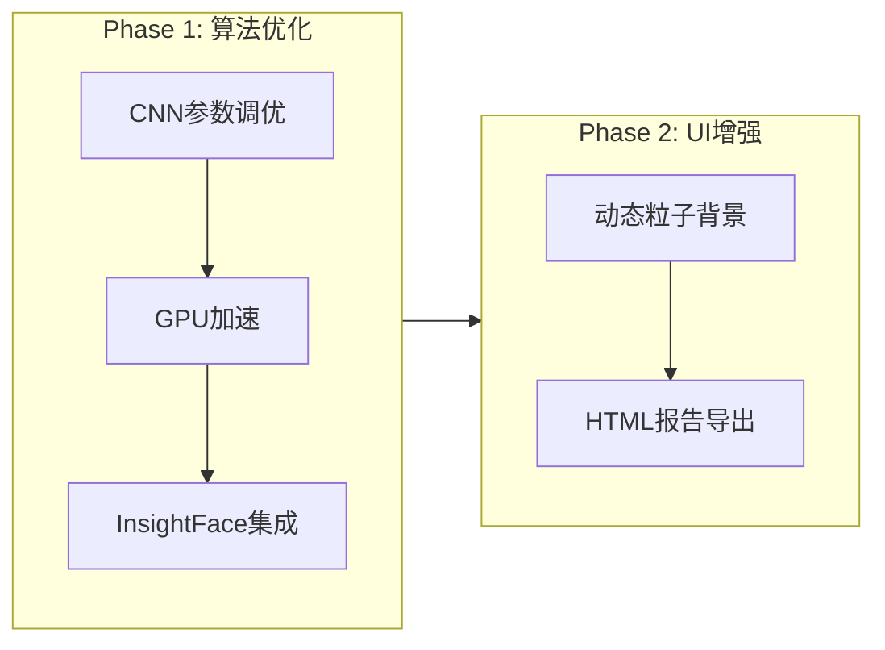

# DeepFocus v2.1 创新功能升级计划

## 总体架构



---

## Phase 1: 算法优化（优先）

### 1.1 CNN参数调优

**问题诊断**：当前CNN效果不如HOG的可能原因

- dlib的CNN在CPU上使用近似算法
- upsample参数设置不当
- 图像预处理流程差异

**优化方案**：| 改进项 | 实现方式 ||--------|----------|| 自动检测GPU | 使用dlib.DLIB_USE_CUDA检测，有GPU自动启用CNN || upsample优化 | CNN模式固定upsample=0（内部已有多尺度） || 图像预处理 | CNN前不做过度预处理，保留原始信息 || 置信度阈值 | 公开CNN的detection confidence参数 |**文件改动**：[`core/face_engine_pro.py`](core/face_engine_pro.py)---

### 1.2 GPU加速检测

**环境**：NVIDIA + CUDA**实现方案**：

```python
# 检测CUDA可用性
import dlib
if dlib.DLIB_USE_CUDA:
    print(f"CUDA可用，GPU数量: {dlib.cuda.get_num_devices()}")
```

| 改进项 | 实现方式 ||--------|----------|| 运行时检测 | 启动时检测CUDA，界面显示GPU状态 || 模型热切换 | CNN模式自动使用GPU版本 || 显存管理 | 大图自动分块处理，避免OOM || 性能统计 | 显示处理耗时，对比CPU/GPU速度 |**新增组件**：

- `core/gpu_utils.py` - GPU检测和管理工具

---

### 1.3 InsightFace/ArcFace 集成

**作为可选项，保留原有HOG/CNN技术选型**：

- **insightface** Python包（基于onnxruntime）
- 检测：RetinaFace / SCRFD
- 识别：ArcFace (buffalo_l模型)

**界面变更**：

```javascript
算法参数 (Config)
├─ 检测模型: ○ HOG(快) ○ CNN(准) ○ RetinaFace(最准)
├─ 识别模型: ○ dlib ○ ArcFace
└─ ...其他参数
```

**新增文件**：

- `core/insightface_engine.py` - InsightFace封装
- `requirements_advanced.txt` - 高级依赖（insightface, onnxruntime-gpu）

**精度对比**（预期）：| 模型 | 小脸 | 侧脸 | 遮挡 | 速度(GPU) ||------|------|------|------|-----------|| HOG | 差 | 差 | 差 | 快 || dlib-CNN | 中 | 中 | 中 | 中 || RetinaFace+ArcFace | 优 | 优 | 良 | 快 |---

## Phase 2: UI增强

### 2.1 动态粒子背景

**效果**：

- 空闲时：淡蓝色粒子缓慢漂浮
- 加载目标时：粒子向中心聚拢
- 识别中：粒子加速流动，脉冲波纹
- 匹配成功：绿色爆发动画

**实现方案**：

- 使用 `QGraphicsView` + `QGraphicsScene`
- 粒子类继承 `QGraphicsEllipseItem`
- `QTimer` 驱动动画（60fps）

**新增文件**：

- `gui/particle_background.py` - 粒子系统组件

---

### 2.2 HTML报告导出

**报告内容**：

```javascript
DeepFocus 识别报告
├─ 概览统计（饼图/柱状图）
├─ 目标人脸信息
├─ 场景分析结果
│   ├─ 缩略图 + 标注
│   ├─ 检测人数/匹配人数
│   └─ 置信度详情
└─ 处理参数记录
```

**技术方案**：

- 使用 `jinja2` 模板引擎
- 内嵌CSS样式（Apple风格）
- 图表使用 `Chart.js`（CDN引入）
- 图片Base64内嵌

**新增文件**：

- `gui/report_generator.py` - 报告生成器
- `templates/report.html` - 报告模板

---

## 依赖更新

```txt
# requirements_advanced.txt (可选高级功能)
insightface>=0.7.3
onnxruntime-gpu>=1.16.0
jinja2>=3.1.2
```