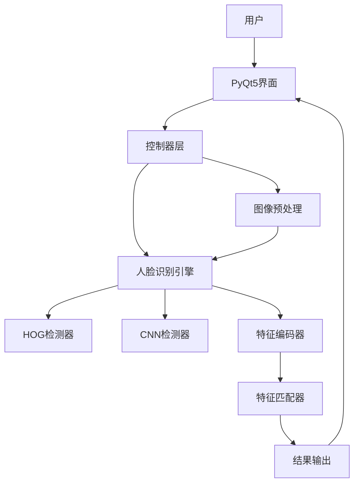

# DeepFocus 人脸识别与定位系统 - 项目规划蓝图

## 概述

本计划将创建两个核心规划文档，为DeepFocus人脸识别与定位应用建立完整的开发框架：

1. **README.md** - 项目蓝图文档，详细描述系统架构、技术栈、目录结构和模块功能
2. **DEV_PLAN.md** - 开发计划文档，按版本划分开发任务，包含详细的子任务和AI提示词

## 项目技术架构

### 核心技术栈

- **编程语言**: Python 3.9+
- **人脸识别**: face_recognition (基于dlib) + OpenCV
- **GUI框架**: PyQt5（现代简洁风格）
- **版本控制**: GitHub (https://github.com/xiaowenhao404/DeepFocus)

### 架构设计模式

采用MVC分层架构：

- **Model层**: 核心算法逻辑（图像处理、人脸检测、特征匹配）
- **View层**: PyQt5用户界面
- **Controller层**: 业务调度和线程管理



## README.md 蓝图结构

### 包含内容

1. **项目介绍**：功能描述、应用场景
2. **技术架构**：技术栈、系统架构图
3. **目录结构**：完整的文件树和功能说明
4. **功能特性**：核心功能列表
5. **安装指南**：环境配置、依赖安装
6. **使用说明**：操作流程、参数说明
7. **开发文档**：模块接口、扩展指南

### 目录结构规划

```javascript
DeepFocus/
├── main.py                      # 应用程序入口
├── config.py                    # 全局配置文件
├── requirements.txt             # Python依赖列表
├── README.md                    # 项目说明文档
├── DEV_PLAN.md                  # 开发计划文档
├── .gitignore                   # Git忽略文件
├── core/                        # 核心算法模块
│   ├── __init__.py
│   ├── image_utils.py           # 图像工具函数
│   ├── preprocessing.py         # 图像预处理（CLAHE等）
│   ├── face_engine.py           # 人脸检测与编码引擎
│   └── matcher.py               # 特征匹配算法
├── gui/                         # 图形界面模块
│   ├── __init__.py
│   ├── main_window.py           # 主窗口界面
│   ├── widgets.py               # 自定义控件
│   ├── styles.qss               # QSS样式表
│   └── worker_threads.py        # 后台工作线程
├── utils/                       # 工具模块
│   ├── __init__.py
│   ├── logger.py                # 日志工具
│   └── file_handler.py          # 文件操作工具
├── tests/                       # 测试模块
│   ├── __init__.py
│   ├── test_face_engine.py      # 人脸引擎测试
│   └── test_preprocessing.py    # 预处理测试
├── Images/                      # 测试图像资源
│   ├── 目标脸.jpg
│   └── Image-1.jpg ~ Image-8.jpg
├── outputs/                     # 输出结果目录
│   ├── results/                 # 识别结果图像
│   └── logs/                    # 运行日志
├── docs/                        # 项目文档
│   └── API.md                   # API文档
└── Reference/                   # 参考资料
    └── 技术实现深度思路.md
```


## DEV_PLAN.md 版本规划

### 版本划分策略

**1.0 版本 - MVP（最小可行产品）**

- 核心识别功能实现
- 基础PyQt5界面
- 单图处理流程

**2.0 版本 - 功能增强**

- 批量处理能力
- 结果保存功能
- HOG/CNN检测器切换
- 界面美化和参数调节

**3.0 版本 - 高级优化**

- 配置持久化
- 性能优化
- 错误处理增强
- 完善文档和测试

### 任务编号规范

- TASK001 ~ TASK006: 1.0版本任务
- TASK007 ~ TASK012: 2.0版本任务
- TASK013 ~ TASK018: 3.0版本任务

每个任务包含：

- 任务名称和版本
- 当前状态（计划中/测试单元编写中/开发中/已完成）
- 子任务清单（最小粒度，可独立完成）
- AI提示词模板（详细的开发指令）
- 验收标准（功能检查清单）
- 注意事项（技术难点和陷阱提醒）

### 关键任务示例

**TASK001**: 项目基础搭建

- 创建目录结构
- 配置依赖管理
- 初始化Git仓库

**TASK002**: 核心人脸引擎开发

- 实现face_engine.py
- HOG检测器集成
- 特征编码功能

**TASK003**: 图像预处理模块

- CLAHE自适应直方图均衡化
- 中文路径支持
- 色彩空间转换

**TASK004**: 基础GUI框架

- PyQt5主窗口设计
- 图像显示控件
- 按钮和事件绑定

**TASK005**: 多线程集成

- QThread工作线程
- 信号槽机制
- 进度反馈

**TASK006**: 特征匹配与结果显示

- 欧氏距离计算
- 阈值判定
- 结果可视化

## 核心开发要点

### 技术难点

1. **中文路径处理**: 使用`np.fromfile` + `cv2.imdecode`代替`cv2.imread`
2. **小目标检测**: `number_of_times_to_upsample=2`参数优化
3. **阈值调优**: 亚洲人脸建议tolerance=0.40-0.45
4. **界面响应**: QThread避免GUI卡顿
5. **内存优化**: 大图先缩放再处理

### 代码规范

- 使用类型注解（Type Hints）
- 遵循PEP 8编码规范
- 编写docstring文档
- 单元测试覆盖核心功能

### Git工作流

- 开发分支：`dev`
- 功能分支：`feature/task-xxx`
- 每个TASK完成后合并到dev
- 版本发布时合并到main

## 下一步行动

1. ✅ 创建 [README.md](README.md) - 完整的项目蓝图文档