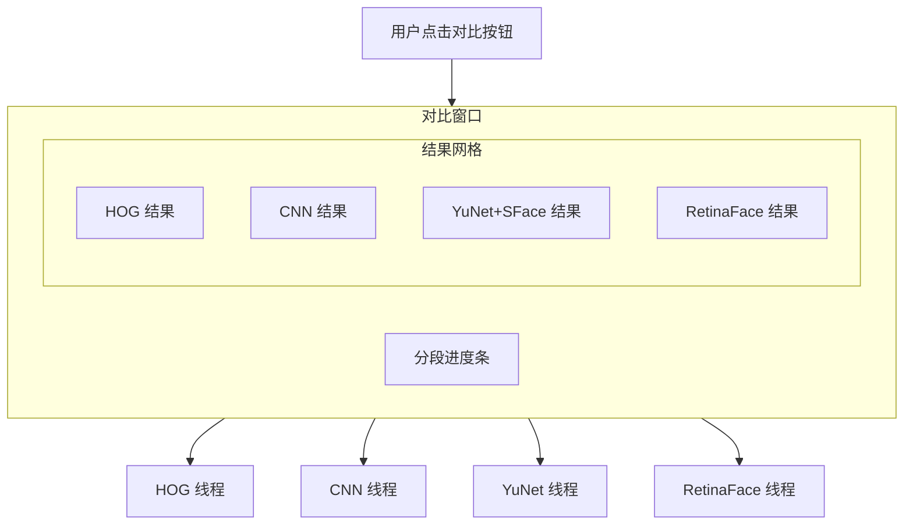

# 添加 OpenCV DNN 引擎和模型对比功能

## 一、技术方案

### 1. OpenCV DNN 引擎 (YuNet + SFace)

参考您朋友的实现方案，使用 OpenCV Zoo 提供的轻量级 ONNX 模型：

- **检测器 YuNet**: `cv2.FaceDetectorYN` - 轻量级 CNN 人脸检测，输出人脸边界框 + 5点关键点
- **识别器 SFace**: `cv2.FaceRecognizerSF` - 将人脸映射为 128 维特征向量，使用余弦相似度匹配

这是 CPU 实现但效果很好的方案，特别适合对侧脸、遮挡等复杂场景。

### 2. 模型对比窗口

创建一个弹出窗口，同时运行多个模型并对比结果：

- 顶部进度条（分段显示各模型进度）
- 网格布局展示各模型识别结果
- 每个结果图支持 Ctrl+滚轮缩放、拖拽平移



---

## 二、需要修改/创建的文件

| 文件 | 操作 | 说明 ||------|------|------|| `models/` | 新建目录 | 存放 ONNX 模型文件 || `core/opencv_dnn_engine.py` | 新建 | OpenCV DNN 引擎（YuNet+SFace） || `core/__init__.py` | 修改 | 导出新引擎 || `gui/compare_dialog.py` | 新建 | 模型对比窗口 || `gui/main_window_pro.py` | 修改 | 添加 YuNet 选项和对比按钮 || `requirements.txt` | 修改 | 确保 opencv-python >= 4.8 |---

## 三、核心实现要点

### 3.1 OpenCV DNN 引擎 ([core/opencv_dnn_engine.py](core/opencv_dnn_engine.py))

```python
# 关键接口（与现有引擎保持一致）
class OpenCVDNNEngine:
    def __init__(self, det_model_path, rec_model_path)
    def add_target_face(path) -> (bool, crop_image)
    def clear_targets()
    def get_target_count() -> int
    def process_scene(scene_path, tolerance, progress_callback) -> (img, stats)
```

模型初始化：

```python
self.detector = cv2.FaceDetectorYN.create(
    model=det_model_path, config="", input_size=(320, 320),
    score_threshold=0.6, nms_threshold=0.3, top_k=5000
)
self.recognizer = cv2.FaceRecognizerSF.create(
    model=rec_model_path, config=""
)
```


### 3.2 模型对比窗口 ([gui/compare_dialog.py](gui/compare_dialog.py))

- 继承自 `QDialog`
- 使用 `QThread` 并行运行各模型
- 进度条分为 N 段（N = 模型数量），每个模型完成后填充对应段
- 使用 `ZoomableStageWidget`（来自 visualization_dialog.py）展示可缩放结果图

### 3.3 主窗口修改 ([gui/main_window_pro.py](gui/main_window_pro.py))

- 在模型选择区添加 `radio_yunet` 单选按钮
- 在工具栏添加"对比模型"按钮
- 懒加载 `OpenCVDNNEngine`
- 连接对比窗口

---

## 四、模型文件获取

需要下载以下 ONNX 模型到 `models/` 目录：