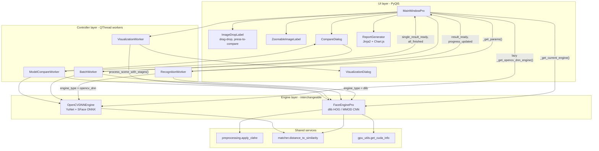

# DeepFocus

**English** | [简体中文](README.zh-CN.md)

A PyQt5 desktop tool that locates one specific person's face inside crowded scene photos, using three interchangeable detection and recognition engines.


---

## Overview

Given one or more reference photos of a target person, DeepFocus scans scene images (group photos, classroom shots) and marks every face, highlighting the ones that match the target with a similarity score.

The interesting part is not the recognition itself — it is that three very different backends (dlib HOG+SVM, dlib MMOD CNN, and OpenCV DNN running YuNet + SFace ONNX) sit behind one call surface, so the same UI, the same worker threads, the same preprocessing controls and the same report pipeline drive all of them. That makes the engines directly comparable: a built-in compare window runs two or three of them on the same image in parallel and shows the results side by side.

The whole application is offline and CPU-capable; CUDA is used only if the installed dlib was built with it.

## Key Features

- **Three interchangeable engines** selected by radio button at runtime — dlib HOG+SVM, dlib MMOD CNN, and OpenCV `FaceDetectorYN` (YuNet) + `FaceRecognizerSF` (SFace), all producing 128-dimensional embeddings.
- **Target-side augmentation**: each reference photo yields up to 5 embeddings (original, horizontal flip, ±10° rotation, gamma-0.6 brightening), each extracted with `num_jitters=5`; a scene face is scored on the minimum distance over the whole bank.
- **Four QThread workers** (single, batch, stage-visualization, per-model comparison) keep the event loop free and stream 0–100 progress back through Qt signals.
- **Tunable preprocessing chain** — gamma LUT (0.30–1.50) followed by CLAHE on the LAB L-channel (clip limit 2.0, 8×8 tiles), with a stage viewer that renders the 5 intermediate images (`original`, `gamma`, `clahe`, `detection`, `final`).
- **Size-adaptive detection**: images above 1500 px (HOG) or 2000 px (CNN) are downscaled before detection and box coordinates are mapped back to full resolution, with the upsample factor derived from the image's longest side.
- **Self-contained HTML report** via Jinja2, embedding every crop as a base64 JPEG and rendering a Chart.js 4.4.1 doughnut plus bar chart of match statistics.

## Architecture



`MainWindowPro` never drives an engine directly during processing. It reads the control panel into a plain `params` dict (`_get_params()`), resolves the active backend (`_get_current_engine()` returns `(engine, engine_type)`), and hands both to a `QThread` worker. The worker branches on `engine_type` to call the matching `process_scene()` signature, then emits `result_ready` / `error_occurred` / `progress_updated`; all image work happens off the UI thread, and the window only paints what arrives on a signal.

The OpenCV DNN engine is constructed lazily on first use, because loading the SFace ONNX graph costs roughly 37 MB of I/O and most sessions never select it. Both engines expose the same target-management surface (`load_target_face`, `add_target_face`, `clear_targets`, `get_target_count`, `get_target_encoding_count`, `get_performance_stats`), so targets are pushed into both banks at load time and switching engines needs no reload.

The per-scene data flow inside an engine:

```mermaid
flowchart LR
    IN["read image<br/>np.fromfile + cv2.imdecode"] --> GAM["gamma LUT<br/>skipped at gamma 1.0"]
    GAM --> CLA["CLAHE on LAB L-channel"]
    CLA --> DS["adaptive downscale<br/>HOG 1500 to 1200 px"]
    DS --> DET["face_locations<br/>hog or cnn"]
    DET --> RM["scale boxes back<br/>to full resolution"]
    RM --> ENC["face_encodings<br/>128-d per face"]
    ENC --> DIST["min distance vs<br/>target embedding bank"]
    DIST --> SIM["distance_to_similarity"]
    SIM --> DRAW["annotate: green best,<br/>yellow match, red miss"]
```



When a downscale happened, boxes are divided back by `scale_factor` and embeddings are re-extracted from the **full-resolution** preprocessed image, so detection gets the speed of a small image while recognition keeps full pixel detail.

## Quick Start

Requirements: Python 3.9+ and, for the dlib engines, a working C++ toolchain (Visual Studio Build Tools on Windows) or a prebuilt dlib wheel.

```bash
git clone https://github.com/xiaowenhao404/DeepFocus.git
cd DeepFocus

python -m venv .venv
.venv\Scripts\activate          # Windows
# source .venv/bin/activate     # macOS / Linux

pip install -r requirements.txt

# Only needed if models/*.onnx are missing; both files are committed to the repo.
python models/download_models.py

python main_pro.py
```

There are no environment variables and no API keys. Runtime defaults (log level, log and output directories, CLAHE constants, app name) live in `config.py` and are read by `main_pro.py`; logs are written to `outputs/logs/app.log` and `outputs/logs/error.log`.

Typical session: load one or more target photos, pick HOG / CNN / YuNet, adjust the tolerance and gamma sliders, load a scene (button or drag-and-drop), run *Recognize*, then optionally open the stage viewer, the model-comparison window, or export the HTML report.

## Project Structure

```
DeepFocus/
├── main_pro.py                 # entry point: logging, dependency probe, QApplication bootstrap
├── config.py                   # paths, CLAHE constants, log settings
├── requirements.txt
│
├── core/                       # engine layer, no Qt imports
│   ├── face_engine_pro.py      # FaceEnginePro: dlib HOG / MMOD CNN, augmentation, staged output
│   ├── opencv_dnn_engine.py    # OpenCVDNNEngine: YuNet detection + SFace embeddings
│   ├── preprocessing.py        # CLAHE, histogram equalization, gamma, denoise helpers
│   ├── matcher.py              # distance metrics, similarity normalization, tolerance presets
│   └── gpu_utils.py            # CUDA probe, safe-resize helpers, PerformanceTimer
│
├── gui/                        # UI + controller layer
│   ├── main_window_pro.py      # MainWindowPro + RecognitionWorker / BatchWorker / VisualizationWorker
│   ├── compare_dialog.py       # CompareDialog + ModelCompareWorker (one thread per model)
│   ├── visualization_dialog.py # stage-by-stage viewer with synchronized zoom
│   ├── report_generator.py     # Jinja2 HTML template + Chart.js charts
│   ├── zoomable_label.py       # pan / zoom image widget
│   ├── image_drop_label.py     # drag-and-drop + press-and-hold original comparison
│   └── modern.qss              # stylesheet
│
├── models/                     # YuNet (~227 KB) and SFace (~37 MB) ONNX files + downloader
├── Images/                     # sample target and scene photos
└── outputs/                    # results and logs (git-ignored)
```

## Design Notes

**Engine swap by duck-typed surface plus an `engine_type` tag, not an abstract base class.**
`FaceEnginePro` and `OpenCVDNNEngine` share method names but not signatures — the dlib path takes `upsample`, `model`, `use_clahe` and `gamma`, while the YuNet path takes only `tolerance` and `best_only`, because YuNet performs its own internal scaling and the ONNX pipeline is run without CLAHE. A formal ABC would have forced a lowest-common-denominator signature and hidden those real differences. The price is visible: the same `if engine_type == "opencv_dnn": ... else: ...` branch is duplicated in `RecognitionWorker`, `BatchWorker` and `ModelCompareWorker`, so adding a fourth engine means touching all three.

**Lazy engine construction and a graceful degradation ladder.**
dlib is imported behind a `try/except RuntimeError` that specifically catches CUDA initialization failures — a broken CUDA install would otherwise kill the app at import time on a machine where the pure-CPU YuNet path would have worked fine. Availability of each backend is probed once (`is_dlib_available()`, `is_opencv_dnn_available()`, `check_models_exist()`), unavailable radio buttons are disabled with the concrete reason in their tooltip, and the default selection falls back HOG → YuNet. The OpenCV engine itself is instantiated only on first selection, and a load failure pops a dialog and switches the radio back to HOG. The cost: availability is resolved at window construction, so installing a missing model file requires a restart.

**Robustness bought on the target side rather than with a bigger model.**
Instead of adding a pose-invariant recognizer, each reference photo is expanded into up to 5 embeddings (original, mirrored, rotated ±10°, gamma-brightened), and a scene face is scored against the minimum distance over the entire bank. This is cheap to implement and helps profile and off-angle faces, but it is not free: loading one target runs five HOG detections plus five `num_jitters=5` encodings, and a larger bank raises the false-accept probability at a fixed tolerance — more chances to fall under the threshold also means more chances to fall under it wrongly.

**Cross-engine similarity normalization, and its honest caveat.**
dlib returns a Euclidean distance (roughly 0–1.2, smaller is better) while SFace returns a cosine similarity (−1–1, larger is better). To let users compare engines in one UI, both are mapped onto a single 0–100 % scale: `(1 − d)^0.8 × 100` for Euclidean, `(cos + 1) / 2 × 100` for cosine. The 0.8 exponent is a readability choice — it lifts low distances so a good match does not read as a lukewarm score. These two mappings are *monotone but not calibrated against each other*: 70 % from HOG and 70 % from YuNet do not represent the same false-accept rate. The tolerance slider operates on the underlying distances, where SFace similarity is first folded into `(1 − sim) / 2` so one threshold spans both metric families.

**Size-adaptive detection with coordinate remapping.**
Detection cost scales with pixel count, recognition quality scales with face detail, and the two pull in opposite directions. The engine resolves this per image: HOG downsizes anything above 1500 px to 1200 px, CNN anything above 2000 px, detection runs on the small copy, boxes are divided back by `scale_factor`, and embeddings are then extracted from the full-resolution preprocessed image. The upsample factor is likewise derived from the longest side (HOG: at most 2 below 600 px, at most 1 below 1200 px, 1 above) instead of being taken verbatim from the UI, so a requested value can be silently clamped — a deliberate trade of user control for not freezing the UI on a 4000-px photo. The cost is a second CLAHE pass over the full-size image whenever a downscale occurred.

**Non-ASCII paths treated as a first-class constraint.**
Every image read goes through `np.fromfile` + `cv2.imdecode` and every write through `cv2.imencode` + `tofile`, because `cv2.imread` / `imwrite` fail on non-ASCII paths on Windows. The ONNX loaders have no such escape hatch, so when the model path contains non-ASCII characters the engine copies both models into a `tempfile.mkdtemp()` directory, loads from there, and registers an `atexit` cleanup. This is a workaround for an upstream limitation, and it silently duplicates about 37 MB on disk for the lifetime of the process.

## Limitations / Roadmap

- **No automated tests and no CI.** Correctness has only been checked interactively through the GUI.
- **Stage visualization is dlib-only.** `process_scene_with_stages()` exists only on `FaceEnginePro`, and `VisualizationWorker` is always constructed with the dlib engine, so the pipeline viewer is unavailable when YuNet is the active backend.
- **dlib is assumed present on several paths.** `load_target_image()`, `clear_targets()` and `compare_models()` dereference `self.engine` unconditionally, even though `__init__` sets it to `None` when the dlib import fails — a YuNet-only installation will hit an `AttributeError` there.
- **Targets must pass dlib detection first.** A reference photo reaches the YuNet/SFace bank only if `FaceEnginePro.add_target_face()` succeeded on it, so a face that dlib misses never gets into the OpenCV engine.
- **Dead code in the library modules.** `matcher.batch_compare`, `find_best_match`, `calculate_match_statistics`, `get_recommended_tolerance` and the four `TOLERANCE_PRESETS` tiers (0.35 / 0.45 / 0.55 / 0.65), plus `preprocessing.denoise_image`, `histogram_equalization` and `gamma_correction`, are implemented and documented but never called by the running pipeline — the UI exposes a continuous 0.30–0.60 tolerance slider instead of the four presets, applies no denoising, and `FaceEnginePro` re-implements gamma internally rather than importing it.
- **`config.py` is only partially honored.** `main_pro.py` uses its logging and path settings, but the GUI hardcodes its own window size and a 0.45 default tolerance, diverging from `WINDOW_WIDTH` / `WINDOW_HEIGHT` and `DEFAULT_TOLERANCE = 0.50`; `MAX_IMAGE_DIMENSION` and `IMAGE_SAVE_QUALITY` are unused.
- **The HTML report needs network access to draw its charts.** Images are inlined as base64, but Chart.js is pulled from a CDN, so the charts stay blank offline.
- **CUDA is opportunistic only.** The CNN engine runs on GPU only if the installed dlib was compiled with CUDA; there is no bundled GPU build and no benchmark of the difference.
- **No `LICENSE` file is present in the repository**, so reuse terms are currently undefined.
