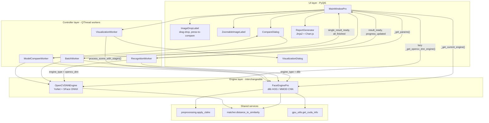

# DeepFocus

[English](README.md) | **简体中文**

一个 PyQt5 桌面工具，用三套可互换的检测与识别引擎，在多人场景照片中定位指定目标人脸。


---

## 概览

给定一张或多张目标人物的参考照片，DeepFocus 会扫描场景图像（合影、教室照片），标注出其中的每一张人脸，并对匹配上目标的人脸给出相似度分数。

真正值得关注的不是识别本身，而是三套差异极大的后端（dlib HOG+SVM、dlib MMOD CNN，以及运行 YuNet + SFace ONNX 的 OpenCV DNN）被收敛到同一套调用面之下：同一个界面、同一批工作线程、同一组预处理控件、同一条报告链路驱动全部三套引擎。这让引擎之间可以直接对比——内置的对比窗口会在同一张图上并行运行其中的两到三套，并把结果并排展示。

整个应用完全离线、可纯 CPU 运行；只有当安装的 dlib 本身带 CUDA 编译时才会用到 GPU。

## 核心特性

- **三套可运行时切换的引擎**，通过单选按钮选择——dlib HOG+SVM、dlib MMOD CNN，以及 OpenCV 的 `FaceDetectorYN`（YuNet）+ `FaceRecognizerSF`（SFace），三者都输出 128 维特征向量。
- **目标侧特征增强**：每张参考照片最多生成 5 个特征向量（原图、水平翻转、±10° 旋转、gamma 0.6 提亮），每个都以 `num_jitters=5` 提取；场景人脸按对整个特征库的最小距离打分。
- **四个 QThread worker**（单图、批量、分阶段可视化、逐模型对比）让事件循环保持空闲，并通过 Qt 信号回传 0–100 的进度。
- **可调预处理链**——先做 gamma LUT（0.30–1.50），再在 LAB 的 L 通道上做 CLAHE（clip limit 2.0、8×8 分块），并配有分阶段查看器渲染 5 张中间图（`original`、`gamma`、`clahe`、`detection`、`final`）。
- **尺寸自适应检测**：长边超过 1500 px（HOG）或 2000 px（CNN）的图像先缩放再检测，检测框坐标随后映射回原始分辨率，上采样次数由图像长边推导。
- **自包含 HTML 报告**：基于 Jinja2 生成，所有裁剪图以 base64 JPEG 内嵌，并用 Chart.js 4.4.1 渲染匹配统计的环形图与柱状图。

## 架构



处理过程中，`MainWindowPro` 从不直接驱动引擎对象。它把控制面板读成一个普通的 `params` 字典（`_get_params()`），解析出当前激活的后端（`_get_current_engine()` 返回 `(engine, engine_type)`），然后把两者一起交给 `QThread` worker。worker 依据 `engine_type` 分支调用对应签名的 `process_scene()`，再发出 `result_ready` / `error_occurred` / `progress_updated`；所有图像处理都在 UI 线程之外完成，窗口只绘制随信号到达的内容。

OpenCV DNN 引擎在首次使用时才惰性构建，因为加载 SFace ONNX 计算图大约需要 37 MB 的 I/O，而多数会话根本不会选到它。两套引擎暴露同一组目标管理接口（`load_target_face`、`add_target_face`、`clear_targets`、`get_target_count`、`get_target_encoding_count`、`get_performance_stats`），所以目标在加载时会同时写入两个特征库，切换引擎无需重新加载。

引擎内部的单张场景数据流：

```mermaid
flowchart LR
    IN["read image<br/>np.fromfile + cv2.imdecode"] --> GAM["gamma LUT<br/>skipped at gamma 1.0"]
    GAM --> CLA["CLAHE on LAB L-channel"]
    CLA --> DS["adaptive downscale<br/>HOG 1500 to 1200 px"]
    DS --> DET["face_locations<br/>hog or cnn"]
    DET --> RM["scale boxes back<br/>to full resolution"]
    RM --> ENC["face_encodings<br/>128-d per face"]
    ENC --> DIST["min distance vs<br/>target embedding bank"]
    DIST --> SIM["distance_to_similarity"]
    SIM --> DRAW["annotate: green best,<br/>yellow match, red miss"]
```



一旦发生过缩放，检测框会按 `scale_factor` 除回原尺寸，特征则在**原分辨率**的预处理图上重新提取——检测拿到小图的速度，识别保留完整的像素细节。

## 快速开始

环境要求：Python 3.9+；使用 dlib 引擎还需要可用的 C++ 工具链（Windows 上为 Visual Studio Build Tools）或预编译的 dlib wheel。

```bash
git clone https://github.com/xiaowenhao404/DeepFocus.git
cd DeepFocus

python -m venv .venv
.venv\Scripts\activate          # Windows
# source .venv/bin/activate     # macOS / Linux

pip install -r requirements.txt

# 仅在 models/*.onnx 缺失时需要执行；两个模型文件已随仓库提交。
python models/download_models.py

python main_pro.py
```

项目不需要任何环境变量与 API key。运行期默认值（日志级别、日志与输出目录、CLAHE 常量、应用名）放在 `config.py`，由 `main_pro.py` 读取；日志写入 `outputs/logs/app.log` 与 `outputs/logs/error.log`。

典型流程：加载一张或多张目标照片，选择 HOG / CNN / YuNet，调节阈值与 gamma 滑块，加载场景（按钮或拖拽），执行「识别」，然后按需打开分阶段查看器、模型对比窗口，或导出 HTML 报告。

## 项目结构

```
DeepFocus/
├── main_pro.py                 # 入口：日志初始化、依赖探测、QApplication 启动
├── config.py                   # 路径、CLAHE 常量、日志设置
├── requirements.txt
│
├── core/                       # 引擎层，不引入 Qt
│   ├── face_engine_pro.py      # FaceEnginePro：dlib HOG / MMOD CNN、特征增强、分阶段输出
│   ├── opencv_dnn_engine.py    # OpenCVDNNEngine：YuNet 检测 + SFace 特征
│   ├── preprocessing.py        # CLAHE、直方图均衡、gamma、去噪等工具函数
│   ├── matcher.py              # 距离度量、相似度归一化、阈值档位
│   └── gpu_utils.py            # CUDA 探测、安全缩放工具、PerformanceTimer
│
├── gui/                        # UI 层 + 控制器层
│   ├── main_window_pro.py      # MainWindowPro + RecognitionWorker / BatchWorker / VisualizationWorker
│   ├── compare_dialog.py       # CompareDialog + ModelCompareWorker（每个模型一个线程）
│   ├── visualization_dialog.py # 分阶段查看器，缩放联动
│   ├── report_generator.py     # Jinja2 HTML 模板 + Chart.js 图表
│   ├── zoomable_label.py       # 平移 / 缩放图像组件
│   ├── image_drop_label.py     # 拖拽上传 + 长按对比原图
│   └── modern.qss              # 样式表
│
├── models/                     # YuNet（约 227 KB）与 SFace（约 37 MB）ONNX 模型及下载脚本
├── Images/                     # 示例目标图与场景图
└── outputs/                    # 结果与日志（已被 git 忽略）
```

## 设计说明

**引擎替换靠鸭子类型接口加 `engine_type` 标签，而非抽象基类。**
`FaceEnginePro` 与 `OpenCVDNNEngine` 方法名一致但签名不同——dlib 路径接收 `upsample`、`model`、`use_clahe`、`gamma`，YuNet 路径只接收 `tolerance` 与 `best_only`，因为 YuNet 自带内部缩放，且 ONNX 链路不走 CLAHE。强行定义一个 ABC（Abstract Base Class，抽象基类）会逼出一个「最小公共签名」，把这些真实差异藏起来。代价是显式的：同一段 `if engine_type == "opencv_dnn": ... else: ...` 分支在 `RecognitionWorker`、`BatchWorker`、`ModelCompareWorker` 中重复了三遍，新增第四套引擎要同时改三处。

**惰性构建引擎，配合逐级降级。**
dlib 的导入被包在专门捕获 CUDA 初始化失败的 `try/except RuntimeError` 里——否则一个损坏的 CUDA 环境会在 import 阶段直接杀死程序，而这台机器上纯 CPU 的 YuNet 路径本来完全可用。每套后端的可用性只探测一次（`is_dlib_available()`、`is_opencv_dnn_available()`、`check_models_exist()`），不可用的单选按钮会被禁用并在 tooltip 里写明具体原因，默认选择按 HOG → YuNet 逐级回退。OpenCV 引擎本身只在首次被选中时实例化，加载失败会弹窗并把单选按钮切回 HOG。代价是：可用性在窗口构造时就已定型，补上缺失的模型文件后需要重启。

**鲁棒性从目标侧买，而不是换更大的模型。**
没有引入位姿不变的识别模型，而是把每张参考照片扩展成最多 5 个特征向量（原图、镜像、±10° 旋转、提亮），场景人脸按对整个特征库的最小距离打分。这实现成本低，对侧脸和非正面角度确有帮助，但并非免费：加载一个目标要跑五次 HOG 检测外加五次 `num_jitters=5` 的编码；而且在固定阈值下，特征库越大，误接受概率越高——「更多机会落到阈值以下」同时也意味着「更多机会错误地落到阈值以下」。

**跨引擎相似度归一化，以及它诚实的注意事项。**
dlib 返回欧氏距离（大致 0–1.2，越小越像），SFace 返回余弦相似度（−1–1，越大越像）。为了让用户在同一界面里横向比较，两者都被映射到统一的 0–100 % 刻度：欧氏用 `(1 − d)^0.8 × 100`，余弦用 `(cos + 1) / 2 × 100`。0.8 这个指数是可读性上的取舍——它抬高了低距离区间，使一次好的匹配不至于显示成一个不温不火的分数。但这两条映射*单调却并未互相标定*：HOG 的 70 % 与 YuNet 的 70 % 并不代表相同的误接受率。阈值滑块作用在底层距离上，SFace 的相似度会先折算成 `(1 − sim) / 2`，从而让同一个阈值能跨越两类度量。

**尺寸自适应检测配合坐标回映射。**
检测开销随像素数增长，识别质量随人脸细节增长，两者方向相反。引擎逐图化解这一矛盾：HOG 把长边超过 1500 px 的图缩到 1200 px，CNN 处理长边超过 2000 px 的图，检测在小图副本上完成，检测框按 `scale_factor` 除回原尺寸，随后在原分辨率的预处理图上提取特征。上采样次数同样由长边推导（HOG：600 px 以下最多 2 次，1200 px 以下最多 1 次，再大固定 1 次），而不是直接采用界面传入的值，因此用户请求的数值可能被静默钳制——这是用一部分用户控制权换取「不会在一张 4000 px 的照片上卡死界面」。代价是一旦发生缩放，就要在全尺寸图上再做一遍 CLAHE。

**把非 ASCII 路径当作一等约束来处理。**
所有图像读取都走 `np.fromfile` + `cv2.imdecode`，写入都走 `cv2.imencode` + `tofile`，因为 `cv2.imread` / `imwrite` 在 Windows 上遇到非 ASCII 路径会失败。ONNX 加载器没有这样的替代入口，因此当模型路径包含非 ASCII 字符时，引擎会把两个模型复制到 `tempfile.mkdtemp()` 创建的临时目录再加载，并注册 `atexit` 清理。这是对上游限制的绕行方案，代价是在进程生命周期内静默多占约 37 MB 磁盘。

## 已知限制 / 后续计划

- **没有自动化测试，也没有 CI。** 正确性目前只通过 GUI 交互验证过。
- **分阶段可视化仅支持 dlib。** `process_scene_with_stages()` 只存在于 `FaceEnginePro` 上，且 `VisualizationWorker` 始终以 dlib 引擎构造，所以当 YuNet 是当前后端时，流程查看器不可用。
- **多处代码默认 dlib 存在。** `load_target_image()`、`clear_targets()`、`compare_models()` 都无条件解引用 `self.engine`，而 `__init__` 在 dlib 导入失败时会把它置为 `None`——纯 YuNet 安装会在这些位置抛出 `AttributeError`。
- **目标必须先通过 dlib 检测。** 只有 `FaceEnginePro.add_target_face()` 成功的参考照片才会进入 YuNet/SFace 特征库，dlib 漏检的人脸永远到不了 OpenCV 引擎。
- **库模块中存在死代码。** `matcher.batch_compare`、`find_best_match`、`calculate_match_statistics`、`get_recommended_tolerance` 以及四档 `TOLERANCE_PRESETS`（0.35 / 0.45 / 0.55 / 0.65），加上 `preprocessing.denoise_image`、`histogram_equalization`、`gamma_correction`，都已实现并写了文档，却从未被运行链路调用——界面暴露的是 0.30–0.60 的连续阈值滑块而非四档预设，不做任何去噪，`FaceEnginePro` 也是内部自己重写了 gamma 而没有复用。
- **`config.py` 只被部分遵守。** `main_pro.py` 用了它的日志与路径配置，但 GUI 硬编码了自己的窗口尺寸和 0.45 的默认阈值，与 `WINDOW_WIDTH` / `WINDOW_HEIGHT` 及 `DEFAULT_TOLERANCE = 0.50` 不一致；`MAX_IMAGE_DIMENSION` 与 `IMAGE_SAVE_QUALITY` 完全未被使用。
- **HTML 报告绘制图表需要联网。** 图片以 base64 内嵌，但 Chart.js 从 CDN 拉取，离线时图表区域会是空白。
- **CUDA 只是机会性使用。** 只有当安装的 dlib 本身带 CUDA 编译时，CNN 引擎才跑在 GPU 上；仓库既没有内置 GPU 构建，也没有对该差异的实测数据。
- **仓库中没有 `LICENSE` 文件**，因此复用条款目前是未定义的。
